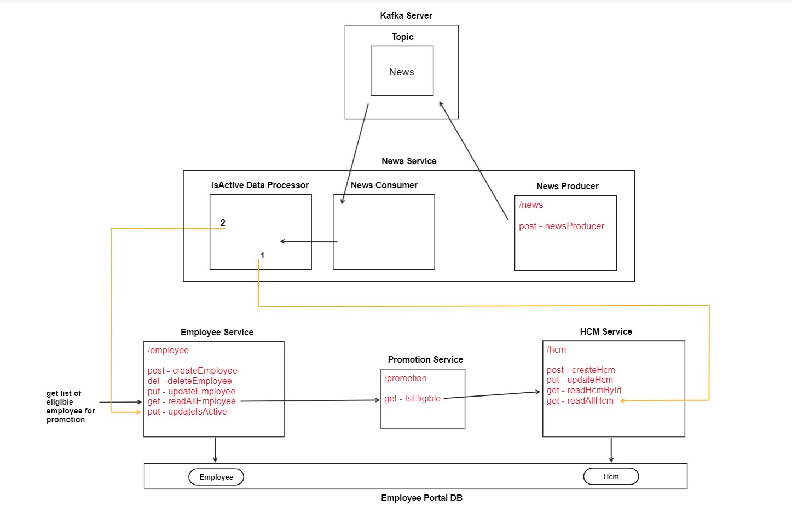

# Employee Promotion Eligibility

Employee Promotion Eligibility is a Microservice based application consist of-

* Employee Service
  * CRUD for Employee
  * Getting the List of Employees eligible for promotion
* Promotion Service
  * Get the Employee details from HCM Service & processing the IsElgible Status for promotion
* HCM Service
  * CRUD for HCM
* News Service
  * Is a Kafka Service
  * Produce the News
  * Consume the News
  * Get All HCM details & process the IsActive status in Employee 

## Tech Stack

* Java
* Spring Boot
* JPA + Hibernate
* JUnit + Mockito
* Maven
* MySQL
* Kafka
* Microservices + Rest APIs

## This Includes

* Proper Package Structure
* Proper URL naming convention
* Proper Naming convention for variable + class + method + constants
* Proper request & response body with status code
* Interface + Implementation
* Builder Pattern
* Enums + Constants
* Optional
* Lombok & Slf4j
* Field Level Validation
* RestTemplate
* Global Exception Handler + Custom Exception
* Kafka Object Producer & Consumer
* Configuration Files

## HLD Architecture

